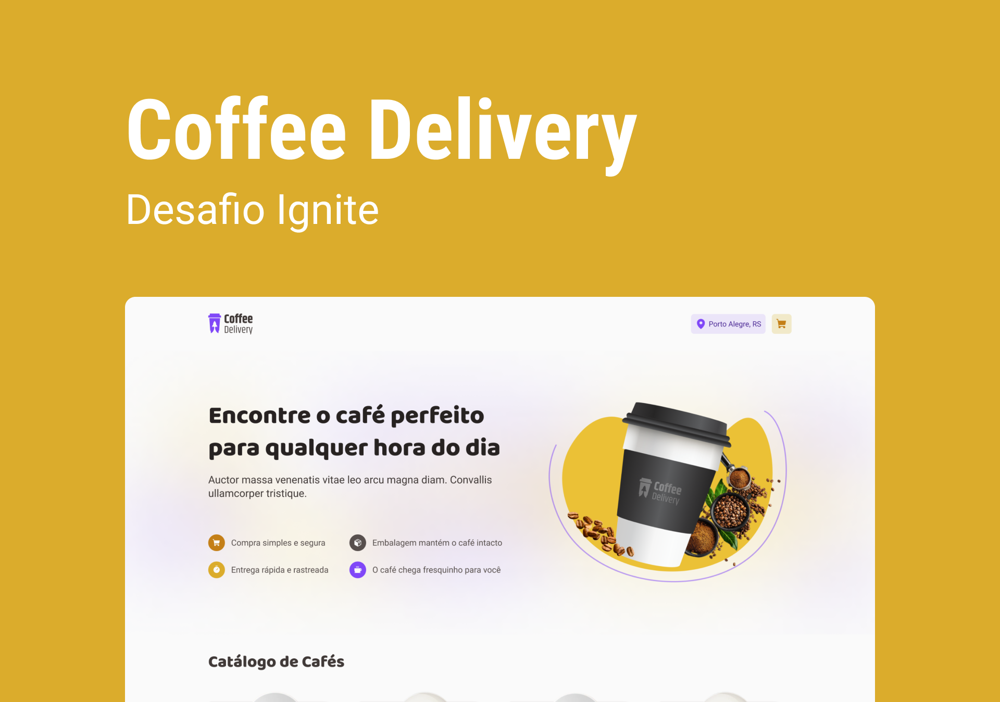

<!-- markdownlint-disable MD033 -->
<!-- markdownlint-disable MD041 -->

<div align="center">
   <a href="https://github.com/mgckaled">
      
   </a>
   
   <a href="https://github.com/mgckaled/ignite-react_coffee-delivery/commits/main">
      
   </a>
   
  
</div>

<br>

<div align="center">
  <a>
     
     
     

  <a/>
</div>

<br>

# Desafio React - Coffee Delivery

<div align="center">

[**Sobre o Projeto**](#sobre-o-projeto) &nbsp;&nbsp;**•**&nbsp;&nbsp;
[**Layout**](#layout) &nbsp;&nbsp;**•**&nbsp;&nbsp;
[**Configurações**](#configurações) &nbsp;&nbsp;**•**&nbsp;&nbsp;
[**Texnologias**](#tecnologias) &nbsp;&nbsp;**•**&nbsp;&nbsp;
[**Licença**](#licença)&nbsp;&nbsp;**•**&nbsp;&nbsp;
[**Autor**](#autor)

</div>
<div align="center">
  
</div>

## Sobre o Projeto

Nesse desafio, foi desenvolvido uma aplicação para gerenciar um carrinho de compras de uma cafeteria fictícia, que contém as seguintes funcionalidades:

- Listagem de produtos (cafés) disponíveis para compra
- Adicionar uma quantidade específicas de itens no carrinho
- Aumentar ou remover a quantidade de itens no carrinho
- Formulário para o usuário preencher o seu endereço
- Exibir o total de itens no carrinho no Header
- Exibir o valor total da soma de itens no carrinho multiplicados pelo valor

## Layout

O layout das telas da aplicação **Coffee Delivery** foi desenvolvido pela equipe da **Rocketseat** através da ferramenta [**Figma**](https://www.figma.com).
Você pode acessar o layout através deste link: [**Coffee Delivery**](https://www.figma.com/file/70gYXgvoJ77QM0Fcdf8Ba8).

## Configurações

Necessário realizar as seguintes instalações:

- [Git](https://git-scm.com/)
- [npm](https://www.npmjs.com/)
- [Node](https://nodejs.org/)

Criar conta e configurar os serviços externos:

- [GitHub](https://github.com/)

Clonar repositório:

```bash
# Execute o comando git clone para realizar o clone do repositório
$ git clone https://github.com/mgkclaed/ignite-react_coffee-delivery.git
# ou execute (necessário installar )
$ gh repo clone mgckaled/ignite-react_coffee-delivery
# Entre na pasta do repositório clonado
$ cd ignite-react_coffee-delivery
```

Dependências e inicialização:

```bash
## instalar dependências
$ npm install
```

Scripts Backend:

```bash
# Rodar servidor em ambiente de desenvolvimento:
$ npm run dev
```

## Tecnologias

Este projeto foi desenvolvido com as seguintes tecnologias:

- [React](https://pt-br.reactjs.org/)
- [TypeScript](https://www.typescriptlang.org/)
- [Vite](https://vitejs.dev/)
- [Styled Components](https://styled-components.com/)
- [React Router Dom](https://v5.reactrouter.com/web/guides/quick-start)
- [React Hook Form](https://react-hook-form.com/)
- [Context API](https://pt-br.reactjs.org/docs/context.html)
- [zod](https://github.com/colinhacks/zod)

## Licença

Distribuído sob a licença **_MIT_**. Veja [LICENSE](LICENSE) para mais informações.

## Autor

Feito por Marcel Kaled. Entre em contato!

---

<h5 align="center">
  &copy;2023 - <a href="https://github.com/mgckaled/">Marcel Kaled</a>
</h5>
